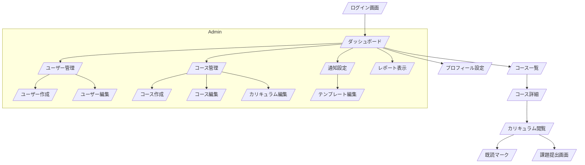

```mermaid
%% 画面遷移図 (詳細)
flowchart TD
  Login[/ログイン画面/] --> Dashboard[/ダッシュボード/]
  Dashboard --> CourseList[/コース一覧/]
  CourseList --> CourseDetail[/コース詳細/]
  CourseDetail --> CurriculumContent[/カリキュラム閲覧/]
  CurriculumContent --> MarkRead[/既読マーク/]
  CurriculumContent --> AssignmentForm[/課題提出画面/]
  Dashboard --> Profile[/プロフィール設定/]

  subgraph Admin
    Dashboard --> AdminUsers[/ユーザー管理/]
    AdminUsers --> UserCreate[/ユーザー作成/]
    AdminUsers --> UserEdit[/ユーザー編集/]
    Dashboard --> AdminCourses[/コース管理/]
    AdminCourses --> CourseCreate[/コース作成/]
    AdminCourses --> CourseEdit[/コース編集/]
    AdminCourses --> CurriculumEditor[/カリキュラム編集/]
    Dashboard --> Notifications[/通知設定/]
    Notifications --> TemplateEdit[/テンプレート編集/]
    Dashboard --> Reports[/レポート表示/]
  end
```

